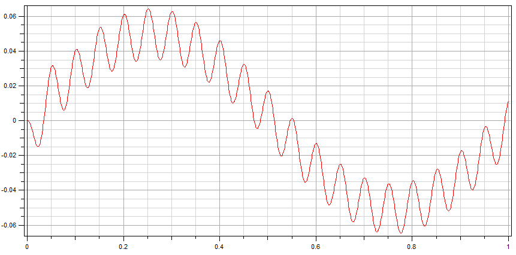

<!---
  SPDX-FileCopyrightText: 2023 SAP SE

  SPDX-License-Identifier: Apache-2.0

  This file is part of FEDEM - https://openfedem.org
--->

# Test description

The model is a structural frame consisting of 10 Beam elements in a L-shape
with 2 supports. All dofs at the lower support are fixed,
at the upper support only the translational z-dof is fixed.

Two inputs are specified:

* In x-direction at Triad 2 a force `1.0e6*sin(2*PI*x)` (loadType = 1)
* In y-direction at Triad 3 a displacement `0.05*sin(2*PI*20*x)` (loadType = 2)

# Response data

* X-position vs. time at Triad 2 (the corner)

# Verification

The results are verified by a time domain analysis (TDA).

# Test setup

Start time is set to 0.0, end time is set to 3.0 with a time increment of 0.01 for the TDA.
A rayleigh damping is specified, with alpha1 = 0.1697 and alpha2 = 0.0094.
For the TDA there is no input load specified.

The setup for the frequency response analysis (FRA) uses the default settings,
with the following parameter changes:

* nrModes is set to 0 which means the direct solution is used (no eigenmode/eigenvector calculation)
* sample_freq is set to 1000.0 (the default is 100.0)
* windowSize is set 0 - no windowing/segmenting is used
* freq_output 18 1 describes output for local dof 1 (translation in X-direction) in Triad with baseId 18

The eigenmode solution interval (eiginc) is set to 1.0, which is the time between each FRA.

# Comments

The results show a main sine with 1 Hz (load at Triad 2)
superimposed by a prescribed sine with 20 Hz frequency.
The rayleigh damping produces a shift (seen at time 0.0).

