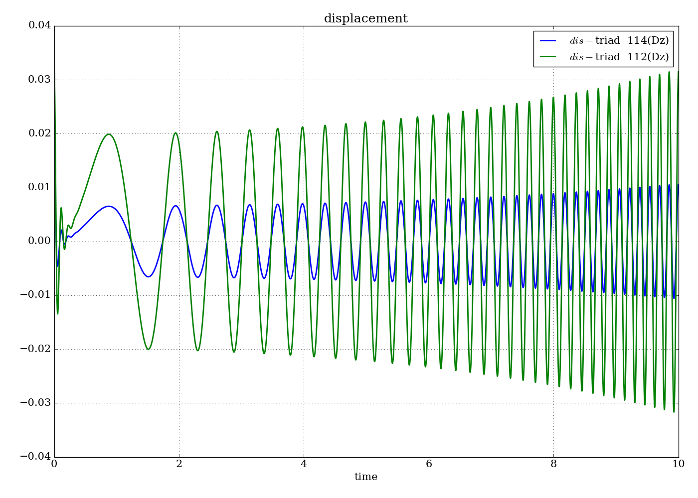
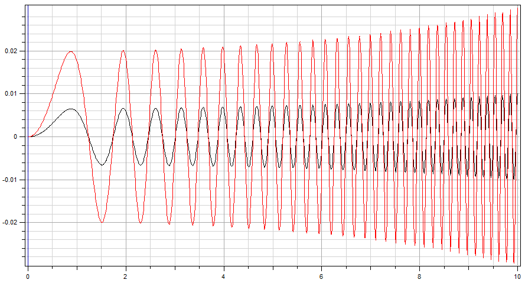

<!---
  SPDX-FileCopyrightText: 2023 SAP SE

  SPDX-License-Identifier: Apache-2.0

  This file is part of FEDEM - https://openfedem.org
--->

# Test description

The model is a 2D cantilever beam consisting of 8 Beam elements
with a fully constrained node at one end, and attached to
an Axial spring and an Axial damper at two different interior points.
The spring and damper are attached to ground at their other end.

A sweep load is acting on at Triad 9 (the free end).

* In z-direction at Triad 9 a force sweep: `20000*sin(2*pi*x^2/3)` (loadType = 1)

# Response data

* Z-position vs. time at Triad 3 (baseId 112)
* Z-position vs. time at Triad 5 (baseId 114)

# Verification

The results are verified by a time domain analysis (TDA).

# Test setup

Start time is set to 0.0, end time is set to 10.0.0 with a time increment of 10.0.
The rayleigh damping is specified, width alpha1 = 0.1697 and alpha2 = 0.0094.
For the TDA there is no input load specified.

The setup for the frequency response analysis (FRA) uses the default settings,
with the following parameter changes:

* sample_freq is set 1000.0 (the default is 100.0)
* nrModes is set 24 (default 0)
* windowSize is set 512 (default 0)
* freq_output 114 3 112 3 describes output for local dof 3 (translation in Z-direction)
  in the Triads with baseId 114 and 112, respectively

# Comments

The result shows a sweep up to 40 Hz within 60 s, starting at 0 Hz (TDA analysis runs up to 10s).
The windowing feature will be used with windowsize 1000 as input
(corrected to 1024 during the analysis - closest number to 1000 represented by 2^n).
At the start the displacements are 0 because the Hann window technology is used
(by multiplying the input with the window function and the windowing function goes to zero at the border).
The results are shown in the two pictures below.

