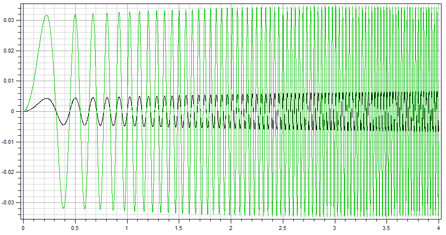

<!---
  SPDX-FileCopyrightText: 2023 SAP SE

  SPDX-License-Identifier: Apache-2.0

  This file is part of FEDEM - https://openfedem.org
--->

# Test description

The model is a 2D cantilever beam consisting of 8 Beam elements
with a fully constrained node at one end.
A displacement-controlled sweep is applied at Triad 5 (the opposite end):

* In y-direction at Triad 5 a displacement controlled sweep: `0.05*sin(2*pi*5*x^2)` (loadType = 2)

# Response data

* Y-position vs. time at Triad 2 (baseId 17)
* Y-position vs. time at Triad 4 (baseId 113)

# Verification

The results are verified by a time domain analysis (TDA).

# Test setup

Start time is set to 0.0, end time is set to 4.0 with a time increment of 4.0 for the TDA.
A rayleigh damping is specified, with alpha1 = 0.1697 and alpha2 = 0.0094.
For the TDA there is no input load specified.

The setup for the frequency response analysis (FRA) uses the default settings,
with the following parameter changes:

* sample_freq is set 1000.0 (the default is 100.0)
* sweep_input 114 2 describes input for local dof 2 (translation in Y-direction) in Triad with baseId 114
* freq_output 113 2 17 2 describes output for local dof 2 (translation in Y-direction)
  in the Triads with baseId 113 and 17, respectively

# Comments

The results show the displacements for Triads 2 and 4. There will be phase shift after passing resonance.
At time 0 there are values based on the FFT (Fast Fourier Transformation) because the sweep function
is not symmetric (first element in the FFT array contains the DC component)
(DC - average of positive and negative half cycles).

