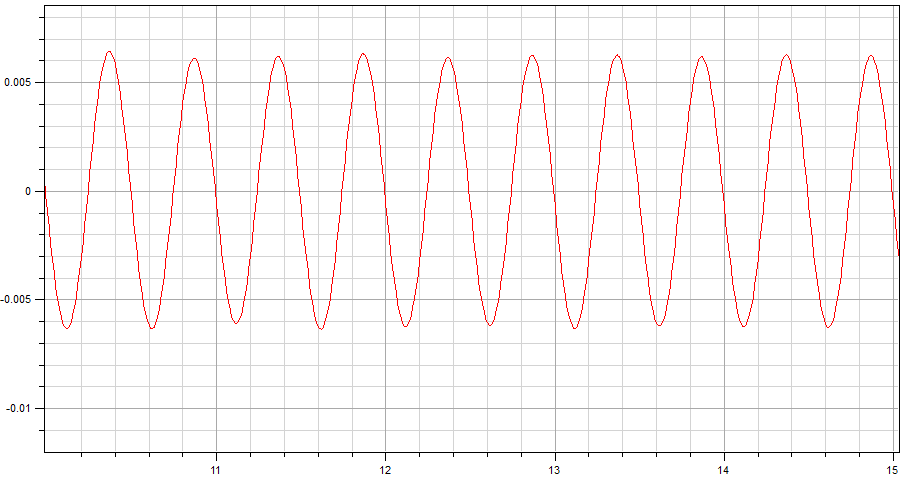

<!---
  SPDX-FileCopyrightText: 2023 SAP SE

  SPDX-License-Identifier: Apache-2.0

  This file is part of FEDEM - https://openfedem.org
--->

# Test description

The model is a tower consisting of 40 Beam elements with 2 Parts at the top.

A horizontal force acts at Triad 41 (the tower top):

* In x-direction at Triad 41 a force `10000*sin(2*pi*40*x)` (loadType = 1)

# Response data

* X-position vs. time at Triad 41 (baseId 137)

# Verification

The results are verified by a time domain analysis (TDA).

# Test setup

Start time is set to 0.0, end time is set to 5.0 with a time increment of 5.0.
No input load for the TDA.
A rayleigh damping is specified, with alpha1 = 0.1697 and alpha2 = 0.0094.

The setup for the frequency response analysis (FRA) uses the default settings,
with the following parameter changes:

* nrModes is set 0 (direct solution)
* sample_freq is set 100.0 (default 100.0)
* windowSize is set to 0
* sweep_input 137 1 describes input for local dof 1 (translation in X-direction) in Triad with baseId 137
* freq_output 137 1 describes output for local dof 1 (translation in X-direction) in Triad with baseId 137

# Comments

The result shows the displacements at Triad 41.
After a certain time of amount (for TDA) the results match the FRA results,
because the TDA integrates the ODE by using initial conditions at time t=0.

