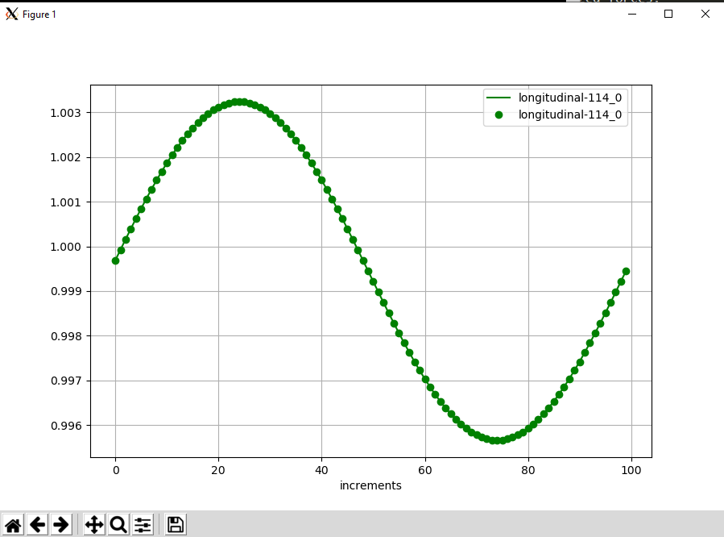

<!---
  SPDX-FileCopyrightText: 2023 SAP SE

  SPDX-License-Identifier: Apache-2.0

  This file is part of FEDEM - https://openfedem.org
--->

# Test description (beam_longitudinal)

The model is a 2D cantilever, consisting of 4 beam elements and 5 triads,
subjected to an unknown load (longitudinal force) at the tip triad.
Gravity is defined alongside by 9810 m/s<sup>2</sup>
(factor 1000.0 for checking the functionality of gravity).
```
  |
  +--------*--------*--------*--------* -->
  |        2        3        4        5
 (16)     (17)    (112)    (113)    (114)   baseID (triadID)
```
The load is calculated from the inverse method based on the measured relative
distance between triad 4 and triad 3.

A graphical plot (see below) presents the longitudinal displacement
at the tip location (triad 114).
The longitudinal load follows the function:

    Fy = 25.0e6*sin(2*Pi*t)

The file `refRelDist.txt` has 1 column, which contains the relative distance.
The input in Fedem uses the change of the relative distance,
therefore the initial length is subtracted from the file values.


# Response data

As mentioned above, a plot is presented and the displacements at location 5
(triad 114) are compared numerically.
The curve plot shows the measurements (reference) as line,
the results from the inverse method are presented as points.
The results satisfy the criterion of acceptance.


