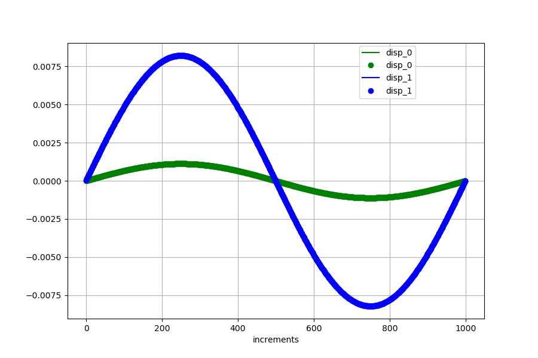

<!---
  SPDX-FileCopyrightText: 2023 SAP SE

  SPDX-License-Identifier: Apache-2.0

  This file is part of FEDEM - https://openfedem.org
--->

# Test description

The model is a 2D cantilever, consisting of 4 beam elements and 5 triads,
subjected to unknown loads. The unknown loads are represented by modal loads.
Gravity is defined alongside.
```
  |                                   ↓
  +--------*--------*--------*--------*
  |        2        3        4        5
 (16)     (17)    (112)    (113)    (114)   baseID(triadID)
```
Based on eigenmode shapes, modal forces are calculated for satisfying the
measurements at triad 17 (DY) and at triad 113 (DY).

Graphical plots (see below) are presented for the displacements at these positions.
The transversal load follows the function:

    Fy = 10000.0*sin(2*Pi*t)

The file `refData.txt` has 3 columns, where the columns contain the
displacement DY at triads 17, 113 and 114, respectively.


# Response data

As mentioned above one plot is presented with results at location 2 and 4
(triads 17 and 113, respectively).
The curve plots show the measurements (reference) as line,
the results from the inverse method are presented as points.
The results satisfy the criterion of acceptance.


