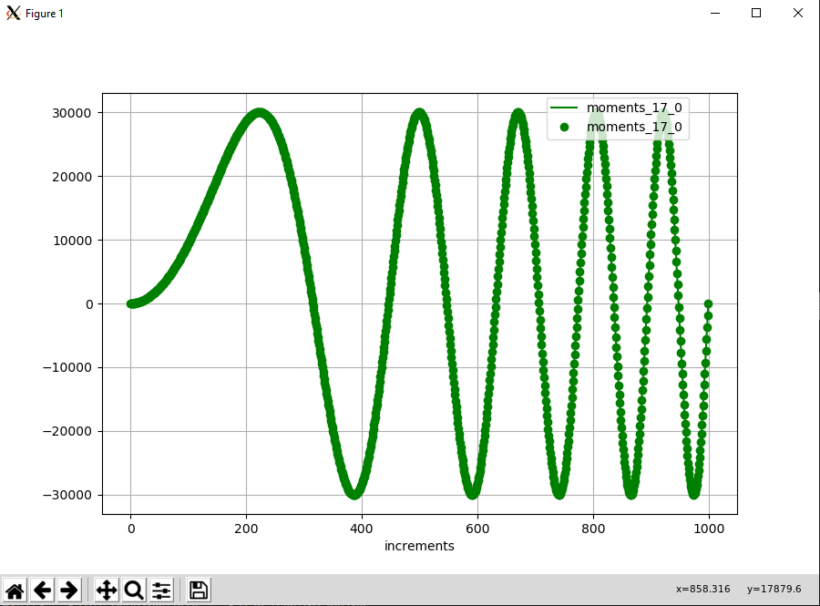
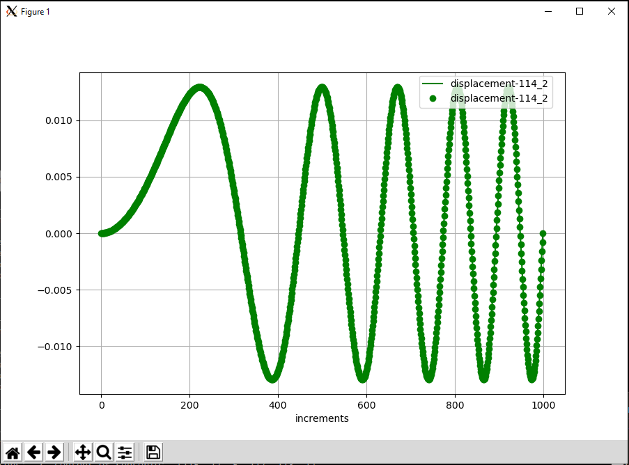

<!---
  SPDX-FileCopyrightText: 2023 SAP SE

  SPDX-License-Identifier: Apache-2.0

  This file is part of FEDEM - https://openfedem.org
--->

# Test description (beam_transversal)

The model is a 2D cantilever, consisting of 4 beam elements and 5 triads,
subjected to unknown loads (shear force and bending moment) at the tip triad.
Gravity is defined alongside.
```
  |                                   ↓
  +--------*--------*--------*--------*
  |        2        3        4        5
 (16)     (17)    (112)    (113)    (114)   baseID(triadID)
```
The loads are calculated from the inverse method based on the measured internal
forces (Mz) at triad 17 and the transversal force (Qz) at triad 113.

Graphical plots (see below) present the internal forces and the transversal
displacement at the tip location 5 (triad 114).
The transversal load follows the function:

    Fy = 10000.0*sin(2*Pi*20.0*t^2/4.0)

The file `refData.txt` has 3 columns, where the first column contains the
bending moment (Mz) at triad 17, the second column the transversal force (Qy)
at triad 113, and the third column the displacements at triad 114.


# Response data

As mentioned above two plots are presented and the displacements at location 2
(triad 17) and location 5 (triad 114) are compared numerically.
The curve plots show the measurements (reference) as line,
the results from the inverse method are presented as points.
The results satisfy the criterion of acceptance.




