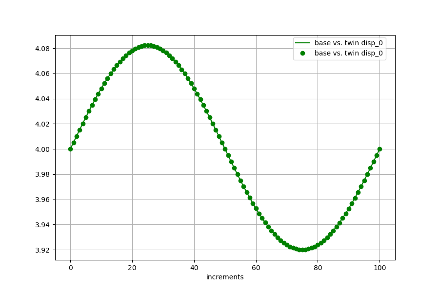

<!---
  SPDX-FileCopyrightText: 2023 SAP SE

  SPDX-License-Identifier: Apache-2.0

  This file is part of FEDEM - https://openfedem.org
--->

# Test description (corner)

The model is build up by 8 beam elements, containing a revolute joint with
a free rotational degree of freedom at the corner with an additional
spring/damper element as a strut.

Model in the x-y plane:

```

   revolute joint
        O--------+--------+------+------+ end triad
        .                *
        .              *
        .            *
        .          *
        +        *   strut (spring/damper)
        .      *
        .    *
        .  *
        +*
        .
        .
        .
        .    vertical beam elements
        +
        .
        .
        .
        .
      +++++ fixed
```

The model is subjected to an unknown load, acting at the end triad.

This unknown load will be calculated by the inverse method by using the
force measurements in the spring, based on a static approach.

The reference file `refData.txt` contains 4 columns, where the columns describe
the spring deflections (first colum), relative displacement (second column),
spring force (third column) and displacements at the end triad as fourth column.
(several data are given here for controlling the functionality)

In the addition the file run_API.py contains an alternative for
the data read-in, by using the utility method sensor_data_matrix().
The read-in data columns are specified in the yaml file or by using a
dictionary as parameter in the method `internal_eq`.

The directory contains a .png file showing the match between the base and
twin simulation.

# Response data

The curve plot shows the measurements (reference) as line,
the results from the inverse method are presented as points.
The results satisfy the criterion of acceptance.


