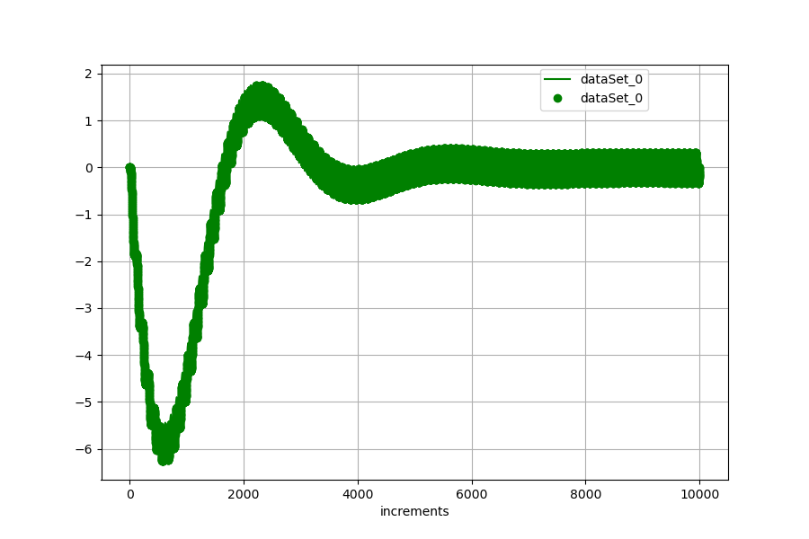
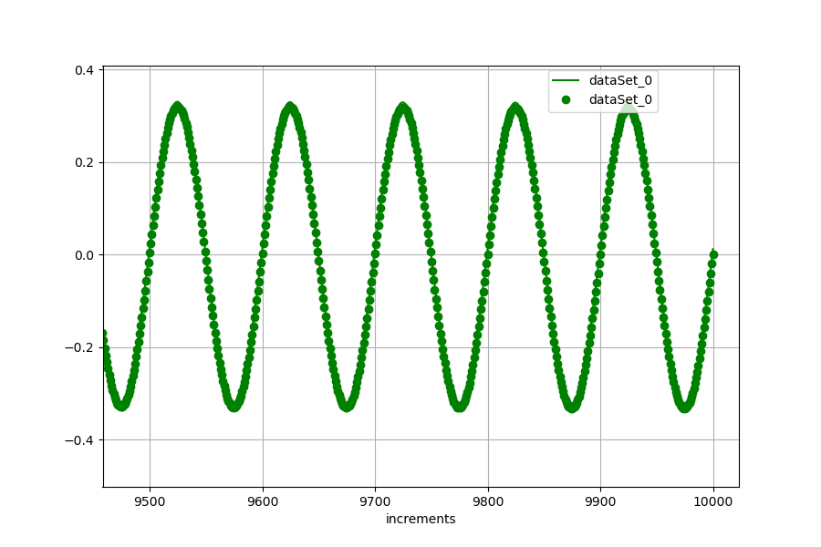

<!---
  SPDX-FileCopyrightText: 2023 SAP SE

  SPDX-License-Identifier: Apache-2.0

  This file is part of FEDEM - https://openfedem.org
--->

# Test description (crane)

The model is build up by 10 beam elements, containing 4 revolute joints,
three with a free rotational degree of freedom (corner, strut beam connection)
and one with fixed rotational but with free translational degree of freedom, stabilized
by a spring (at the strut). The strut itself is built by beam elements.

Model in the x-y plane
```

   revolute joint (rJ)   (rJ)
        O--------+--------O------+------+ end triad
        .                *
        .              *
        .            *   beam
        .          *
        +        O (rJ, fixed rz but free tz, stabilized by a spring)
        .      *
        .    *
        .  *  beam
  (rJ)  O*
        .
        .
        .
        .    vertical beam elements
        +
        .
        .
        .
        .
      +++++ fixed
```

The model is subjected to an unknown load, acting at the end triad.

This unknown load will be calculated by the dynamic inverse method by using the
force measurements in the spring at the revolute joint.
The spring force will be converted to a displacement, based on linearity
between force and deflection (currently implementation)

The reference file `refData.txt` contains 4 columns, where columns describes
the revolute joint displacement in z, the displacement at the end triad in y (see figure),
the spring deflection and the spring force in z direction at the
revolute joint (several data are given for controlling the functionality, column 1 and
3 must have the same measurements).

In the directory is a .png file showing the match between the base and
twin simulation.

# Response data

The curve plot shows the measurements (reference) as line,
the results from the inverse method are presented as points.
For checking the stability of the dynamic inverse method (DIM)
the analysis run is set to 10000 steps (increments).
The results satisfy the criterion of acceptance.



The figure below shows a section of the analysis.


