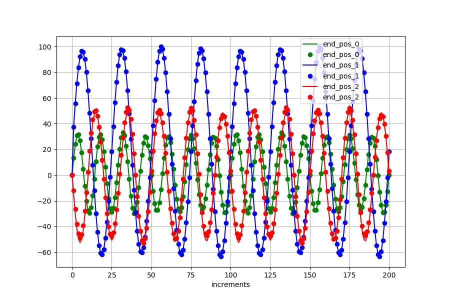

<!---
  SPDX-FileCopyrightText: 2023 SAP SE

  SPDX-License-Identifier: Apache-2.0

  This file is part of FEDEM - https://openfedem.org
--->

# Test description (frame internal force)

The model is a 3D frame consisting of beam elements and an FE part with shell
elements, including a rigid joint, an axial spring and an axial damper.
Forces in global X-, Y- and Z-direction are defined, following a sinusoidal
function with different amplitudes and frequencies.
Gravity is defined in global Z-direction.

Front view:
```
        cantilever (beam elements)
     +-------------------------------+
     |        *
     |      *
     |    *   strut (spring and damper)
     |  *
     |*
     |
     |
     |  column (shell elements)
     |
    --- constraint in 6 directions
```
Top view:
```
                                     +  force acting point
                                     |
                                     |  transverse cantilever (beam elements)
                                     |
     +-------------------------------+
        cantilever (beam elements)
```

At the force acting point the internal forces are evaluated.
Based on the evaluations and by using the section force-based inverse method the acting force will be calculated.

# Setup

The internal forces/section forces (base simulation) measured by sensors
are stored in the file `refData.txt` which is used as reference.
At the end of the simulation the results are compared with the results in the
reference file. In addition a graphical presentation of the results is also
available (by setting `plotCurves=True` in the `run_API.py` script).

The curve plot shows the measurements (reference) as line,
the results from the inverse method are presented as points.


