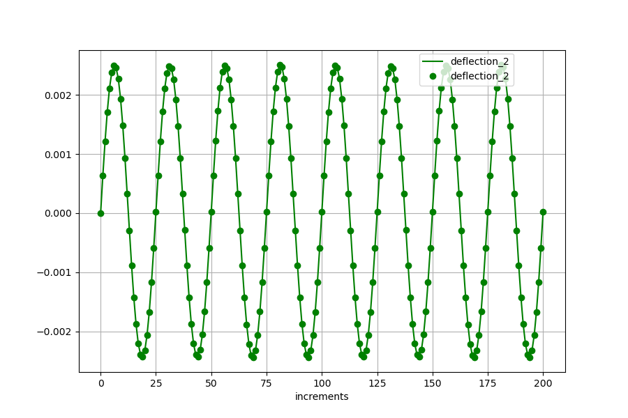

<!---
  SPDX-FileCopyrightText: 2023 SAP SE

  SPDX-License-Identifier: Apache-2.0

  This file is part of FEDEM - https://openfedem.org
--->

# Test description (frame relative displacement)

The model is a 3D frame consisting of beam elements and an FE part with shell
elements, including a revolute joint, an axial spring and an axial damper.
Forces in global Y- and Z-direction are defined, following a sinusoidal function
with different amplitudes and frequencies.
Gravity is defined in global Z-direction.

Front view:
```
    rJ   cantilever (beam elements)
     +-------------------------------+
     |        *
     |      *
     |    *   strut (spring and damper)
     |  *
     |*
     |
     |
     |  column (shell elements)
     |
    --- constraint in 6 directions
```
Top view:
```
                                     +  force acting point
                                     |
                                     |  transverse cantilever (beam elements)
                                     |
     +-------------------------------+
        cantilever (beam elements)
```

The deflection at the spring and the displacement at the force acting point are measured.
Based on the evaluations and by using the spring-deflection/displacement inverse method
the acting force will be calculated.

# Setup

The spring deflection and the displacement in y direction at the end triad
are measured by sensors and stored in the file `refData.txt` as reference.
At the end of the simulation the results are compared with the results in the
reference file. In addition a graphical presentation of the results is also
available (by setting `plot_curves=True` in the `run_API.py` script).

The curve plot shows the measurements (reference) as line,
the results from the inverse method are presented as points.


