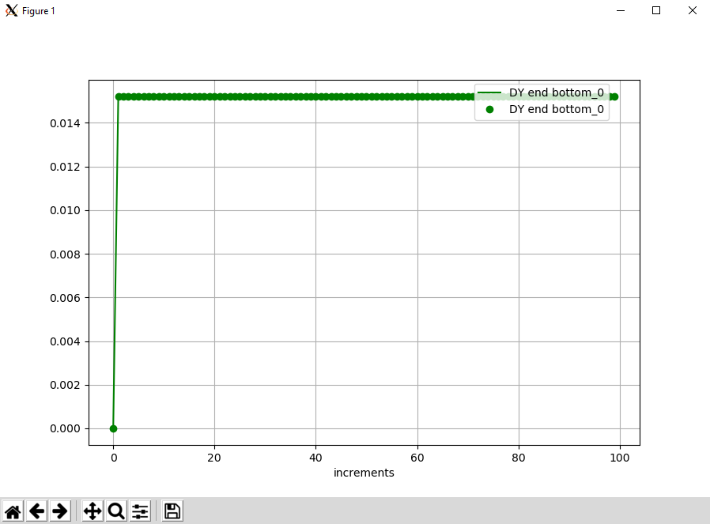

<!---
  SPDX-FileCopyrightText: 2023 SAP SE

  SPDX-License-Identifier: Apache-2.0

  This file is part of FEDEM - https://openfedem.org
--->

# Test description (shell_strain)

The model is a 2D cantilever membrane,
consisting of 4 shell elements and 4 triads,
subjected to 2 unknown loads (transverse forces) at the tip triads 22 and 21.
No gravity is defined.
```
                                      4
  2                                  (22)
 (20)                                 ↓
  +--------*--------*--------*--------*
  |   (1)  |   (2)  |   (3)  |   (4)  |
  +--------*--------*--------*--------*
  1                                   ↓
 (19)                                 3
                                     (21)   baseID (triadID)
```
The load is calculated from the inverse method based on measured strains
in the end element (4).

A graphical plot presents the transversal displacement at the bottom tip
location 3 (triad 21).

The constant transversal load is defined by:

    Fy = 10000

at the positions 3 (triad 21) and 4 (triad 22).

The file `refBaseStrain.txt` has 3 columns, which contain the 3 strain tensor
components e1, e2 and e12.


# Response data

As mentioned above a plot is presented and the displacements at location 3
(triad 21) are compared numerically.
The curve plot shows the measurements (reference) as line,
the results from the inverse method are presented as points.
The results satisfy the criterion of acceptance.


