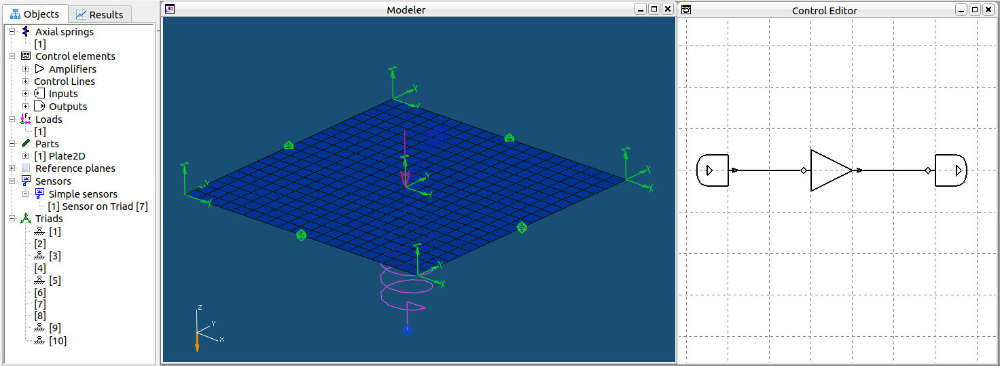

<!---
  SPDX-FileCopyrightText: 2023 SAP SE

  SPDX-License-Identifier: Apache-2.0

  This file is part of FEDEM - https://openfedem.org
--->

# Modal analysis with integrated control system

## Test 1

The model consists of a square plate with side length 1 m and thickness 1 mm
fully constrained in all 6 DOFs at the four corner nodes (see image).
The plate is modelled with 20&times;20=400 4-noded shell elements.
Additional triads for system level DOFs are located at
the mid-point of each edge as well as at the place center.
This results in a total of 30 free DOFs at the system level.

A vertical axial spring is attached between the center triad and ground.
In addition, a simple control system consisting of an amplifier element
is defined to behave similarly as the spring.



A passively and actively damped system is the obtained by assigning the stiffness
(10000 N/m) as the spring stiffness coefficient and amplifier parameter (gain),
respectively.

# Response data

* The first 10 eigenfrequencies.

# Verification

Both systems should result in the following eigenfrequencies:

```
Mode#  Hz
   1   4.83167076
   2   5.10432720
   3   5.99252892
   4   6.26710320
   5   19.0065594
   6   24.5073395
   7   26.1759300
   8   26.4981842
   9   36.1065636
  10   45.2199249
```
